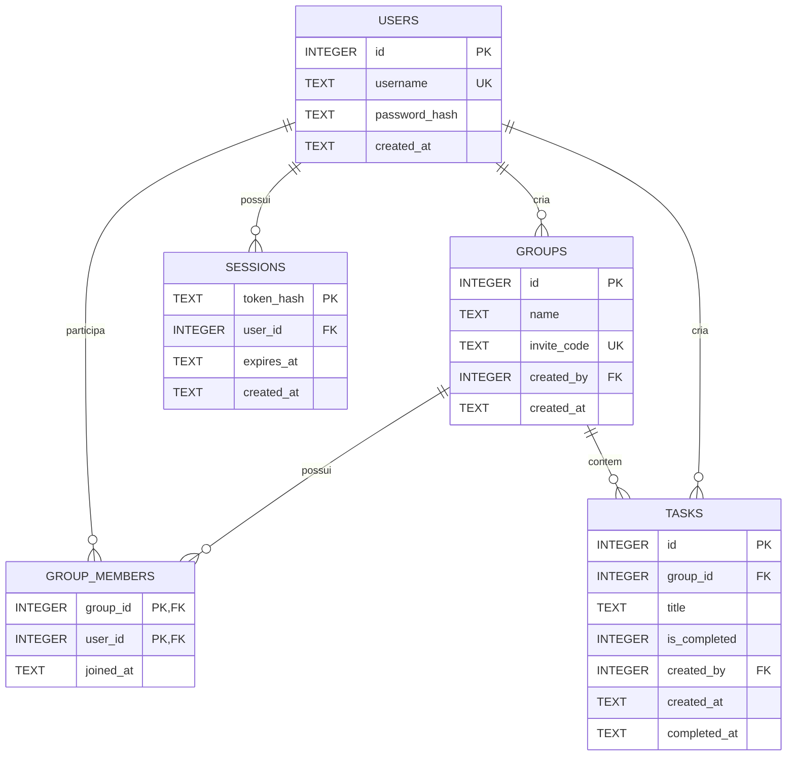

# Banco de Dados — Organizador de Trabalhos em Grupo

## 1. Tecnologia escolhida

O projeto utiliza **SQLite**, um banco de dados relacional armazenado localmente em um único arquivo. A escolha reduz a configuração necessária para executar o MVP e mantém os recursos de SQL, chaves estrangeiras, restrições e transações.

O Node.js acessará o SQLite por meio do módulo nativo `node:sqlite`. Assim, esta etapa não exige a instalação de uma biblioteca externa.

## 2. Diagrama entidade-relacionamento



## 3. Relacionamentos

- Um usuário pode criar vários grupos.
- Um usuário pode participar de vários grupos.
- Um grupo pode possuir vários usuários.
- A relação muitos para muitos entre usuários e grupos é representada por `group_members`.
- Um grupo pode possuir várias tarefas.
- Cada tarefa pertence a exatamente um grupo.
- Um usuário pode criar várias tarefas.
- Um usuário pode possuir várias sessões, por exemplo, em navegadores diferentes.

## 4. Tabelas

### 4.1 `users`

Armazena as contas dos usuários.

| Campo | Tipo | Restrições | Finalidade |
|---|---|---|---|
| `id` | INTEGER | PK | Identificador do usuário |
| `username` | TEXT | obrigatório, único, 3 a 30 caracteres | Nome usado no login |
| `password_hash` | TEXT | obrigatório | Resultado seguro do processamento da senha |
| `created_at` | TEXT | obrigatório, valor automático | Data e hora do cadastro |

O campo `username` usa comparação sem diferença entre letras maiúsculas e minúsculas. Portanto, `Isaac` e `isaac` representam o mesmo nome.

### 4.2 `groups`

Armazena os grupos de trabalho.

| Campo | Tipo | Restrições | Finalidade |
|---|---|---|---|
| `id` | INTEGER | PK | Identificador do grupo |
| `name` | TEXT | obrigatório, 1 a 80 caracteres | Nome do grupo |
| `invite_code` | TEXT | obrigatório, único, 8 caracteres | Código usado para entrar no grupo |
| `created_by` | INTEGER | FK para `users.id` | Criador do grupo |
| `created_at` | TEXT | obrigatório, valor automático | Data e hora da criação |

O código será gerado pelo back-end e não poderá ser escolhido pelo usuário.

### 4.3 `group_members`

Relaciona usuários e grupos.

| Campo | Tipo | Restrições | Finalidade |
|---|---|---|---|
| `group_id` | INTEGER | PK composta, FK para `groups.id` | Grupo |
| `user_id` | INTEGER | PK composta, FK para `users.id` | Participante |
| `joined_at` | TEXT | obrigatório, valor automático | Data e hora da entrada |

A chave primária composta por `group_id` e `user_id` impede que o mesmo usuário participe duas vezes do mesmo grupo.

### 4.4 `tasks`

Armazena as tarefas compartilhadas.

| Campo | Tipo | Restrições | Finalidade |
|---|---|---|---|
| `id` | INTEGER | PK | Identificador da tarefa |
| `group_id` | INTEGER | FK para `groups.id` | Grupo da tarefa |
| `title` | TEXT | obrigatório, 1 a 120 caracteres | Descrição curta da tarefa |
| `is_completed` | INTEGER | somente `0` ou `1` | Estado da tarefa |
| `created_by` | INTEGER | FK para `users.id` | Usuário que criou a tarefa |
| `created_at` | TEXT | obrigatório, valor automático | Data e hora da criação |
| `completed_at` | TEXT | opcional | Data e hora da conclusão |

O SQLite representa o estado com números:

- `0`: tarefa pendente;
- `1`: tarefa concluída.

Uma tarefa pendente deve possuir `completed_at` vazio. Uma tarefa concluída deve possuir uma data de conclusão.

### 4.5 `sessions`

Armazena sessões persistentes de autenticação.

| Campo | Tipo | Restrições | Finalidade |
|---|---|---|---|
| `token_hash` | TEXT | PK | Hash do identificador secreto da sessão |
| `user_id` | INTEGER | FK para `users.id` | Usuário autenticado |
| `expires_at` | TEXT | obrigatório | Data e hora de expiração |
| `created_at` | TEXT | obrigatório, valor automático | Data e hora da criação |

O navegador manterá o identificador original em um cookie protegido. O banco guardará apenas seu hash, não a senha nem o token original.

## 5. Chaves e integridade

- `PRIMARY KEY` identifica unicamente cada registro.
- `FOREIGN KEY` impede referências a usuários ou grupos inexistentes.
- `UNIQUE` evita nomes de usuário e códigos repetidos.
- `NOT NULL` torna obrigatório o preenchimento de um campo.
- `CHECK` limita tamanhos e valores permitidos.
- `ON DELETE CASCADE` remove participantes e tarefas quando seu grupo é removido.
- `STRICT` faz o SQLite verificar os tipos declarados com mais rigor.

O back-end deverá ativar `PRAGMA foreign_keys = ON` em cada conexão com o banco.

## 6. Índices

Foram criados índices para as consultas mais frequentes:

- localizar os grupos de um usuário;
- listar tarefas por grupo e estado;
- localizar sessões de um usuário;
- remover sessões expiradas.

As restrições `UNIQUE` também criam índices para nome de usuário e código de convite.

## 7. Arquivos do banco

- [`../database/schema.sql`](../database/schema.sql): definição reproduzível das tabelas, restrições e índices.
- [`../database/init-db.js`](../database/init-db.js): cria o arquivo local `app.db`.
- [`../database/test-db.js`](../database/test-db.js): valida o esquema em um banco temporário.
- `database/app.db`: banco SQLite vazio, pronto para avaliação e incluído no repositório.

## 8. Comandos

Na raiz do projeto:

```bash
node database/init-db.js
node database/test-db.js
```

O primeiro comando cria ou atualiza as estruturas do banco local. O segundo testa nomes únicos, participantes duplicados, chaves estrangeiras, conclusão de tarefas e exclusões em cascata.

## 9. Exemplo do fluxo armazenado

1. Isaac e Tassia são registrados em `users`.
2. Isaac cria um registro em `groups`.
3. Isaac é inserido automaticamente em `group_members` pela aplicação.
4. Tassia informa o código e também é inserida em `group_members`.
5. Isaac cria uma tarefa em `tasks`.
6. Tassia visualiza a tarefa pelo grupo compartilhado.
7. Tassia conclui a tarefa e o sistema atualiza `is_completed` e `completed_at`.

Esse fluxo atende ao cenário principal definido na análise de requisitos e no BPMN.
