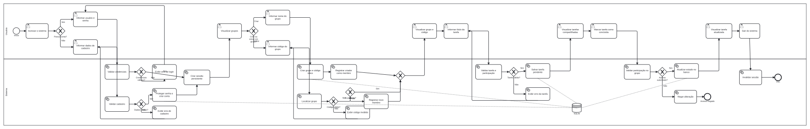

# BPMN — Organizador de Trabalhos em Grupo

## Objetivo do diagrama

O diagrama representa o fluxo principal do MVP, desde o acesso do usuário até a criação e a conclusão de uma tarefa compartilhada. Ele também registra os principais caminhos alternativos de validação e segurança.

## Arquivos

- [`BPMN_ORGANIZADOR.bpmn`](./BPMN_ORGANIZADOR.bpmn): modelo BPMN 2.0 editável e compatível com o editor bpmn.io.
- [`BPMN_ORGANIZADOR.svg`](./BPMN_ORGANIZADOR.svg): representação visual para consulta e inclusão no PDF do projeto.

## Processo modelado

**Nome:** Organizar trabalho em grupo.

**Início:** usuário acessa a aplicação.

**Fim principal:** usuário encerra sua sessão depois de utilizar as tarefas do grupo.

**Fim alternativo:** tentativa de alteração é encerrada quando o usuário não possui acesso ao grupo.

## Raias e responsabilidades

### Usuário

Representa as decisões e ações humanas:

- acessar o sistema;
- informar dados de cadastro ou login;
- visualizar seus grupos;
- escolher entre criar ou entrar em um grupo;
- informar o nome ou o código do grupo;
- visualizar o grupo;
- informar uma tarefa;
- visualizar as tarefas compartilhadas;
- marcar uma tarefa como concluída;
- visualizar a atualização;
- sair do sistema.

### Sistema

Representa as ações executadas pelo back-end:

- validar cadastro e credenciais;
- proteger a senha;
- criar e invalidar a sessão;
- criar grupo e código único;
- registrar criador e novos membros;
- localizar o grupo pelo código;
- validar tarefa e participação;
- salvar a tarefa como pendente;
- atualizar o estado da tarefa;
- negar operações não autorizadas.

## Armazenamento de dados

O elemento **SQLite** representa o banco de dados local. Ele armazena contas, grupos, participantes, tarefas e seus estados.

## Fluxo principal

1. O usuário acessa o sistema.
2. O usuário faz login ou realiza seu cadastro.
3. O sistema valida os dados e cria uma sessão persistente.
4. O usuário visualiza seus grupos.
5. O usuário cria um grupo ou entra em um grupo usando um código.
6. O sistema registra a participação e libera a visualização do grupo.
7. O usuário informa o título de uma tarefa.
8. O sistema valida e salva a tarefa inicialmente como pendente.
9. Os integrantes visualizam a tarefa compartilhada.
10. Um integrante marca a tarefa como concluída.
11. O sistema confirma a autorização e atualiza o banco.
12. O usuário visualiza a atualização e encerra sua sessão.

## Fluxos alternativos

- **Credenciais inválidas:** o sistema apresenta o erro e retorna ao login.
- **Cadastro inválido:** o sistema apresenta o erro e retorna ao formulário de cadastro.
- **Código inexistente:** o sistema informa que o código é inválido e permite uma nova tentativa.
- **Usuário já participante:** o sistema não duplica o vínculo e segue para a visualização do grupo.
- **Tarefa inválida:** o sistema apresenta o erro e retorna à criação da tarefa.
- **Acesso não autorizado:** o sistema nega a alteração e encerra esse fluxo.

## Relação com os requisitos

| Parte do processo | Requisitos relacionados |
|---|---|
| Cadastro, login e sessão | RF01, RF02, RF03, RF04, RNF01 e RNF02 |
| Listagem e criação de grupos | RF05, RF06 e RF07 |
| Entrada por código | RF08, RN03, RN05 e RN06 |
| Visualização protegida do grupo | RF09, RNF03 e RN07 |
| Criação de tarefa | RF10, RN08, RN09 e RN10 |
| Listagem e conclusão de tarefas | RF11, RF12 e RN11 |

## Edição do modelo

O arquivo `.bpmn` pode ser aberto no editor on-line do [bpmn.io](https://demo.bpmn.io/). Depois de qualquer alteração no modelo, a imagem SVG também deve ser exportada novamente para manter os dois arquivos sincronizados.
